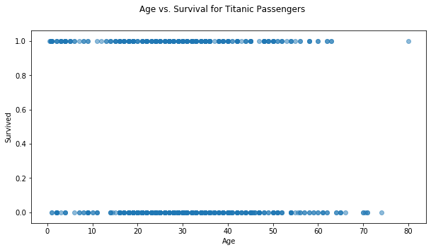
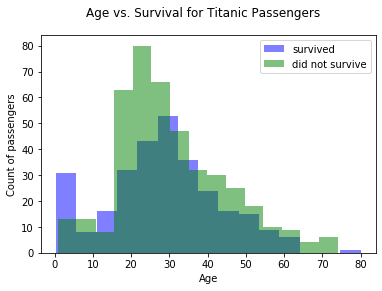
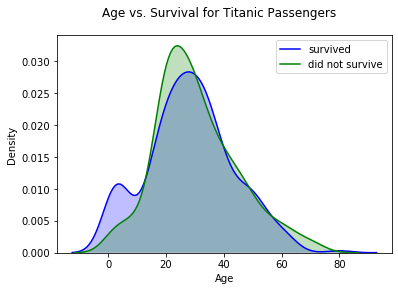
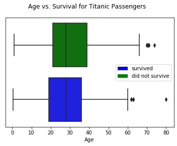
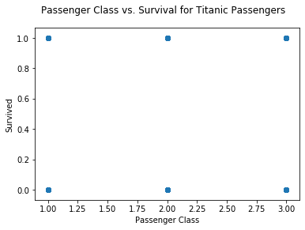
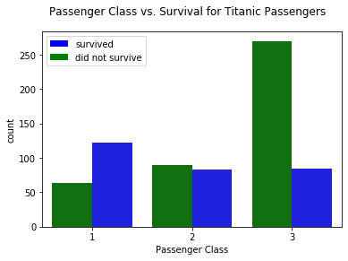
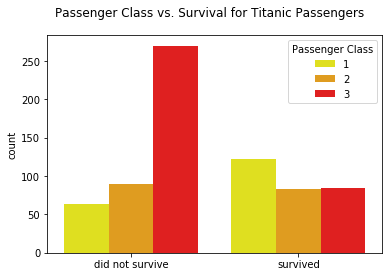
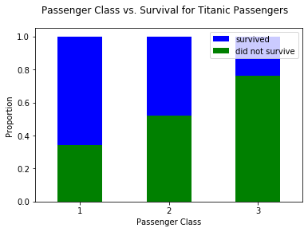
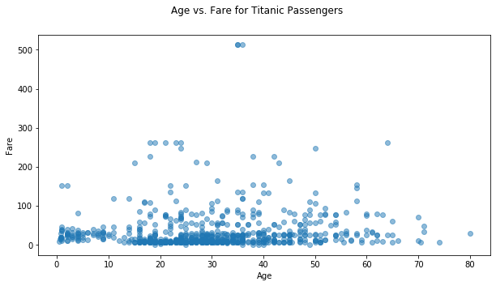
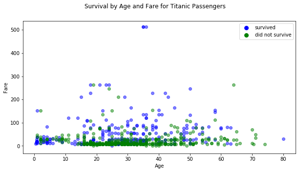

# EDA with Categorical Variables

Whether EDA (exploratory data analysis) is the main purpose of your project, or is mainly being used for feature selection/feature engineering in a machine learning context, it's important to be able to understand the relationship between your features and your target variable.

Many examples of EDA emphasize numeric features, but this notebook emphasizes categorical features.


```python
import pandas as pd
import numpy as np

import matplotlib.pyplot as plt
from matplotlib.patches import Patch
from matplotlib.lines import Line2D
import seaborn as sns
```

## The Dataset

This analysis uses the [Titanic dataset](https://www.kaggle.com/c/titanic/data) in order to predict whether a given person survived or not

This dataset has the following columns:

| Variable | Definition | Key |
| -------- | ---------- | --- |
| survival | Survival | 0 = No, 1 = Yes |
| pclass | Ticket class | 1 = 1st, 2 = 2nd, 3 = 3rd |
| sex | Sex | |
| Age | Age in years | |
| sibsp | # of siblings / spouses aboard the Titanic | |
| parch | # of parents / children aboard the Titanic | |
| ticket | Ticket number | |
| fare | Passenger fare | |
| cabin | Cabin number | |
| embarked | Port of Embarkation | C = Cherbourg, Q = Queenstown, S = Southampton |

To get started, we'll open up the CSV with Pandas.

(If you were using this for a machine learning project, you would additionally separate the dataframe into `X` and `y`, and then into train and test sets, but for the purposes of this example we'll assume that the entire `titanic.csv` contains training data.)


```python
df = pd.read_csv("titanic.csv")

# PassengerId is a dataset artifact, not something useful for analysis
df.drop("PassengerId", axis=1, inplace=True)

# We want to use Age as one of the main examples, drop rows that are missing Age values
df.dropna(subset=["Age"], inplace=True)

df.head()
```


<div>
<style scoped>
    .dataframe tbody tr th:only-of-type {
        vertical-align: middle;
    }

    .dataframe tbody tr th {
        vertical-align: top;
    }

    .dataframe thead th {
        text-align: right;
    }
</style>
<table border="1" class="dataframe">
  <thead>
    <tr style="text-align: right;">
      <th></th>
      <th>Survived</th>
      <th>Pclass</th>
      <th>Name</th>
      <th>Sex</th>
      <th>Age</th>
      <th>SibSp</th>
      <th>Parch</th>
      <th>Ticket</th>
      <th>Fare</th>
      <th>Cabin</th>
      <th>Embarked</th>
    </tr>
  </thead>
  <tbody>
    <tr>
      <th>0</th>
      <td>0</td>
      <td>3</td>
      <td>Braund, Mr. Owen Harris</td>
      <td>male</td>
      <td>22.0</td>
      <td>1</td>
      <td>0</td>
      <td>A/5 21171</td>
      <td>7.2500</td>
      <td>NaN</td>
      <td>S</td>
    </tr>
    <tr>
      <th>1</th>
      <td>1</td>
      <td>1</td>
      <td>Cumings, Mrs. John Bradley (Florence Briggs Th...</td>
      <td>female</td>
      <td>38.0</td>
      <td>1</td>
      <td>0</td>
      <td>PC 17599</td>
      <td>71.2833</td>
      <td>C85</td>
      <td>C</td>
    </tr>
    <tr>
      <th>2</th>
      <td>1</td>
      <td>3</td>
      <td>Heikkinen, Miss. Laina</td>
      <td>female</td>
      <td>26.0</td>
      <td>0</td>
      <td>0</td>
      <td>STON/O2. 3101282</td>
      <td>7.9250</td>
      <td>NaN</td>
      <td>S</td>
    </tr>
    <tr>
      <th>3</th>
      <td>1</td>
      <td>1</td>
      <td>Futrelle, Mrs. Jacques Heath (Lily May Peel)</td>
      <td>female</td>
      <td>35.0</td>
      <td>1</td>
      <td>0</td>
      <td>113803</td>
      <td>53.1000</td>
      <td>C123</td>
      <td>S</td>
    </tr>
    <tr>
      <th>4</th>
      <td>0</td>
      <td>3</td>
      <td>Allen, Mr. William Henry</td>
      <td>male</td>
      <td>35.0</td>
      <td>0</td>
      <td>0</td>
      <td>373450</td>
      <td>8.0500</td>
      <td>NaN</td>
      <td>S</td>
    </tr>
  </tbody>
</table>
</div>


## Numeric vs. Categorical EDA

Here we are trying to see the relationship between a given numeric feature and the target, which is categorical.  Let's use the `Age` column as an example.

### What Not to Do

One thought we might have would be just to use a scatter plot, since the categorical target has already been encoded as 0s and 1s:


```python
fig, ax = plt.subplots(figsize=(10,5))

ax.scatter(df["Age"], df["Survived"], alpha=0.5)

ax.set_xlabel("Age")
ax.set_ylabel("Survived")

fig.suptitle("Age vs. Survival for Titanic Passengers");
```





Ok, we can see that age seems to matter some, but it's pretty hard to extract much useful information from this visualization.  Let's try some other visualizations that tell us more

### Multiple Histograms

Rather than using the y axis to represent the two categories, let's use two different colors.  That means that we can use the y axis to represent counts rather than trying to discern this information from the density of dots.


```python
fig, ax = plt.subplots()

ax.hist(df[df["Survived"]==1]["Age"], bins=15, alpha=0.5, color="blue", label="survived")
ax.hist(df[df["Survived"]==0]["Age"], bins=15, alpha=0.5, color="green", label="did not survive")

ax.set_xlabel("Age")
ax.set_ylabel("Count of passengers")

fig.suptitle("Age vs. Survival for Titanic Passengers")

ax.legend();
```





### Multiple Density Estimate Plots

This is showing largely the same information as the histograms, except that it's a density estimate (estimate of the probability density function) rather than a count across bins.  Seaborn has nice built-in functionality for this.


```python
fig, ax = plt.subplots()

sns.kdeplot(df[df["Survived"]==1]["Age"], shade=True, color="blue", label="survived", ax=ax)
sns.kdeplot(df[df["Survived"]==0]["Age"], shade=True, color="green", label="did not survive", ax=ax)

ax.set_xlabel("Age")
ax.set_ylabel("Density")

fig.suptitle("Age vs. Survival for Titanic Passengers");
```





### Multiple Box Plots

Here we lose some of the information about the distribution overall in order to focus in on particular summary statistics of the distribution

<a title="Dcbmariano / CC BY-SA (https://creativecommons.org/licenses/by-sa/4.0)" href="https://commons.wikimedia.org/wiki/File:Box_plot_description.jpg"></a>

Matplotlib and Seaborn both have methods for this.  The Seaborn one is built on top of the Matplotlib one.


```python
fig, ax = plt.subplots()

sns.boxplot(x="Age", y="Survived", data=df, orient="h", palette={1:"blue", 0:"green"}, ax=ax)

ax.get_yaxis().set_visible(False)

fig.suptitle("Age vs. Survival for Titanic Passengers")

color_patches = [
    Patch(facecolor="blue", label="survived"),
    Patch(facecolor="green", label="did not survive")
]
ax.legend(handles=color_patches);
```





## Categorical vs. Categorical EDA

Here we are trying to see the relationship between a given categorical variable and the target (which is also categorical).  Let's use the `Pclass` (passenger class) feature as an example.

### What Not to Do

Again, there is nothing _preventing_ us from just making a scatter plot, since the passenger class is encoded as a number


```python
fig, ax = plt.subplots()

ax.scatter(df["Pclass"], df["Survived"], alpha=0.5)

ax.set_xlabel("Passenger Class")
ax.set_ylabel("Survived")

fig.suptitle("Passenger Class vs. Survival for Titanic Passengers");
```





...but that plot is not really useful at all.  It's really just telling us that at least 1 person falls into each category

### Grouped Bar Charts

This shows the distribution across the categories, similar to the "multiple histograms" example for numeric vs. categorical


```python
fig, ax = plt.subplots()

sns.catplot("Pclass", hue="Survived", data=df, kind="count", 
            palette={1:"blue", 0:"green"}, ax=ax)

plt.close(2) # catplot creates an extra figure we don't need

ax.set_xlabel("Passenger Class")

color_patches = [
    Patch(facecolor="blue", label="survived"),
    Patch(facecolor="green", label="did not survive")
]
ax.legend(handles=color_patches)

fig.suptitle("Passenger Class vs. Survival for Titanic Passengers");
```





```python
fig, ax = plt.subplots()

sns.catplot("Survived", hue="Pclass", data=df, kind="count", 
            palette={1:"yellow", 2:"orange", 3:"red"}, ax=ax)

plt.close(2) # catplot creates an extra figure we don't need

ax.legend(title="Passenger Class")
ax.set_xticklabels(["did not survive", "survived"])
ax.set_xlabel("")

fig.suptitle("Passenger Class vs. Survival for Titanic Passengers");
```





### Stacked Bar Charts

These can be used for counts (same as grouped bar charts) but if you use percentages rather than counts, they show proportions


```python
# Create a dataframe with the counts by passenger class and survival
counts_df = df.groupby(["Pclass", "Survived"])["Name"].count().unstack()
counts_df
```


<div>
<style scoped>
    .dataframe tbody tr th:only-of-type {
        vertical-align: middle;
    }

    .dataframe tbody tr th {
        vertical-align: top;
    }

    .dataframe thead th {
        text-align: right;
    }
</style>
<table border="1" class="dataframe">
  <thead>
    <tr style="text-align: right;">
      <th>Survived</th>
      <th>0</th>
      <th>1</th>
    </tr>
    <tr>
      <th>Pclass</th>
      <th></th>
      <th></th>
    </tr>
  </thead>
  <tbody>
    <tr>
      <th>1</th>
      <td>64</td>
      <td>122</td>
    </tr>
    <tr>
      <th>2</th>
      <td>90</td>
      <td>83</td>
    </tr>
    <tr>
      <th>3</th>
      <td>270</td>
      <td>85</td>
    </tr>
  </tbody>
</table>
</div>


```python
# Divide by the total number and transpose for plotting
pclass_percents_df = counts_df.div(counts_df.sum()).T
pclass_percents_df
```


<div>
<style scoped>
    .dataframe tbody tr th:only-of-type {
        vertical-align: middle;
    }

    .dataframe tbody tr th {
        vertical-align: top;
    }

    .dataframe thead th {
        text-align: right;
    }
</style>
<table border="1" class="dataframe">
  <thead>
    <tr style="text-align: right;">
      <th>Pclass</th>
      <th>1</th>
      <th>2</th>
      <th>3</th>
    </tr>
    <tr>
      <th>Survived</th>
      <th></th>
      <th></th>
      <th></th>
    </tr>
  </thead>
  <tbody>
    <tr>
      <th>0</th>
      <td>0.150943</td>
      <td>0.212264</td>
      <td>0.636792</td>
    </tr>
    <tr>
      <th>1</th>
      <td>0.420690</td>
      <td>0.286207</td>
      <td>0.293103</td>
    </tr>
  </tbody>
</table>
</div>


```python
fig, ax = plt.subplots()

pclass_percents_df.plot(kind="bar", stacked=True, color=["yellow", "orange", "red"], ax=ax)

ax.legend(title="Passenger Class")
ax.set_xticklabels(["did not survive", "survived"], rotation=0)
ax.set_xlabel("")
ax.set_ylabel("Proportion")

fig.suptitle("Passenger Class vs. Survival for Titanic Passengers");
```


```python
# Use the same counts df, but now survived + did not survive add up to 1
survived_percents_df = counts_df.T.div(counts_df.T.sum()).T
survived_percents_df
```


<div>
<style scoped>
    .dataframe tbody tr th:only-of-type {
        vertical-align: middle;
    }

    .dataframe tbody tr th {
        vertical-align: top;
    }

    .dataframe thead th {
        text-align: right;
    }
</style>
<table border="1" class="dataframe">
  <thead>
    <tr style="text-align: right;">
      <th>Survived</th>
      <th>0</th>
      <th>1</th>
    </tr>
    <tr>
      <th>Pclass</th>
      <th></th>
      <th></th>
    </tr>
  </thead>
  <tbody>
    <tr>
      <th>1</th>
      <td>0.344086</td>
      <td>0.655914</td>
    </tr>
    <tr>
      <th>2</th>
      <td>0.520231</td>
      <td>0.479769</td>
    </tr>
    <tr>
      <th>3</th>
      <td>0.760563</td>
      <td>0.239437</td>
    </tr>
  </tbody>
</table>
</div>


```python
fig, ax = plt.subplots()

survived_percents_df.plot(kind="bar", stacked=True, color=["green", "blue"], ax=ax)

ax.set_xlabel("Passenger Class")
ax.set_xticklabels([1, 2, 3], rotation=0)
ax.set_ylabel("Proportion")

color_patches = [
    Patch(facecolor="blue", label="survived"),
    Patch(facecolor="green", label="did not survive")
]
ax.legend(handles=color_patches)

fig.suptitle("Passenger Class vs. Survival for Titanic Passengers");
```





## Numeric vs. Numeric vs. Categorical EDA

Sometimes it's interesting to see the relationship between two different numeric features and the target

### What Not to Do

You could just make a scatter plot of the two numeric features


```python
fig, ax = plt.subplots(figsize=(10, 5))

ax.scatter(df["Age"], df["Fare"], alpha=0.5)

ax.set_xlabel("Age")
ax.set_ylabel("Fare")

fig.suptitle("Age vs. Fare for Titanic Passengers");
```





That's fine if the relationship between Age and Fare is what interests you, but it doesn't give you any information about the relationship between these features and the target

### Scatterplot with Color to Distinguish Categories

This kind of plot could help you understand how the two features relate to the target


```python
fig, ax = plt.subplots(figsize=(10, 5))

ax.scatter(df[df["Survived"]==1]["Age"], df[df["Survived"]==1]["Fare"], c="blue", alpha=0.5)
ax.scatter(df[df["Survived"]==0]["Age"], df[df["Survived"]==0]["Fare"], c="green", alpha=0.5)

ax.set_xlabel("Age")
ax.set_ylabel("Fare")

color_patches = [
    Line2D([0], [0], marker='o', color='w', label='survived', markerfacecolor='b', markersize=10),
    Line2D([0], [0], marker='o', color='w', label='did not survive', markerfacecolor='g', markersize=10)
]
ax.legend(handles=color_patches)

fig.suptitle("Survival by Age and Fare for Titanic Passengers");
```





## Summary

Most of the time if your target is a categorical variable, the best EDA visualization isn't going to be a basic scatter plot.  Instead, consider:

#### Numeric vs. Categorical (e.g. `Survived` vs. `Age`)
 - Multiple histograms
 - Multiple density estimate plots
 - Multiple box plots

#### Categorical vs. Categorical (e.g. `Survived` vs. `Pclass`)
 - Grouped bar charts
 - Stacked bar charts

#### Numeric vs. Numeric vs. Categorical (e.g. `Age` vs. `Fare` vs. `Survived`)
 - Color-coded scatter plots


```python

```
